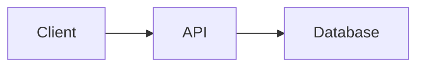

# Operium

> Persistent secondary memory for AI coding assistants — for you and your team.

Operium captures your AI coding sessions, learns your team's conventions, and recalls
the right context the next time you (or a teammate) work on the same code — over the
Model Context Protocol (MCP).

This is the **v2 clean rebuild**: Next.js + Express + MongoDB, in a pnpm
monorepo with a framework-free core.

## Stack

- **Frontend** — Next.js (App Router) + TypeScript + Tailwind
- **Backend** — Express + TypeScript (REST + MCP HTTP transport + embed worker)
- **Database** — MongoDB (Mongoose models; text search + embeddings stored per-chunk)
- **AI** — Google Gemini (768-dim embeddings + Flash summarization)
- **Monorepo** — pnpm workspaces + Turborepo

## Layout

```
apps/
  web/   Next.js — landing + dashboard
  api/   Express — REST, MCP, embed worker
packages/
  shared/  types + zod schemas (web ↔ api)
  db/      Mongoose models + connectDB (MongoDB)
  core/    framework-free domain logic (memory pipeline, embeddings, ranking)
  mcp/     MCP server built on @modelcontextprotocol/sdk
```

**Layering rule:** `core` has no framework/HTTP deps; `api` and `mcp` are thin adapters
over it. Same logic serves REST, MCP-HTTP, and MCP-stdio.

## Develop

```bash
nvm use                 # Node 24
corepack enable         # pnpm
pnpm install
cp .env.example .env     # fill MONGODB_URI, JWT_SECRET, etc.
cp .env.example apps/api/.env

pnpm dev                # run web + api
```

`pnpm typecheck` and `pnpm test` must be green before committing.

## My Tasks

My Tasks is the default tab on the Tasks page. The Kanban board uses dnd kit:
drag a card's handle between To Do, In Progress, Done, and Cancelled, or use
the card's status selector. Keyboard dragging uses Space, Left/Right, and
Space to drop (Escape cancels). Cards are sorted by priority, not manual order.
Visible Edit/Delete actions support full task editing and confirmed deletion.

Tasks are personal: users see tasks assigned to them and their own unassigned
tasks, not tasks assigned to someone else. The same authorization applies to
REST lists, counts, updates/deletes and MCP task reads/updates. The MCP
`list_tasks` compatibility option `mine: false` no longer exposes team tasks.
Organization membership is still required when an organization is selected;
users without an organization can manage their personal tasks. Azure Boards
is a separate integration and its permissions are unchanged.

Deploy the rebuilt web app and updated API/MCP together. No database migration
is required; existing unassigned tasks remain available to their creator.

## Mermaid diagrams in notes

Use **Insert diagram** in a normal note, or include a Mermaid fenced block:

````markdown
## Request flow

Text and diagrams can live in the same note.


````

Each diagram has **Chart / Code**, zoom, fit-to-view, and fullscreen controls.
Shared notes render the same diagrams with read-only source. Markdown remains
the saved format; no new note type or migration is required.

The existing MCP tools `create_note`, `append_note`, `update_note`, and `get_note`
support these fences. Reads return source, not images; updates replace the full
body, so retain surrounding text. Large Mermaid fences stay intact in storage.
Previews are limited to 50,000 characters and 500 edges; invalid or oversized
source stays saved and editable. Diagram callbacks and navigation are disabled.

For the PM2 deployment, install dependencies and rebuild the web app, then
restart both `operium-web` and `operium-api` to load the updated renderer and
MCP chunking logic. Existing diagrams previously split across fences are not
automatically repaired; re-save their complete source.

## Deploy (recommended)

| Layer | Service |
|---|---|
| MongoDB | [Atlas](https://www.mongodb.com/atlas) |
| Frontend (web) | [Vercel](https://vercel.com) |
| Backend (api) | [Railway](https://railway.app) / [Render](https://render.com) |

The backend needs a long-running host (MCP SSE + the embed worker), so a serverless
function won't do for `api`.
